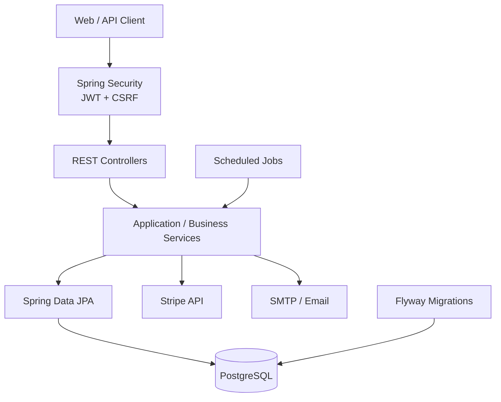
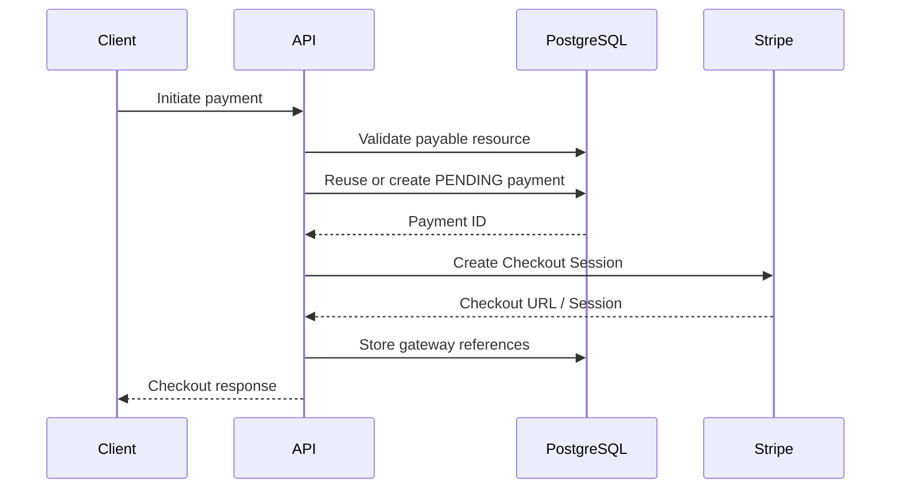

# Library Management System API


Backend REST API for a library management platform built with **Java 21**, **Spring Boot 3.3.7** and **PostgreSQL**.

The project covers the complete library workflow: catalog management, loans, reservations, reviews, wishlists, fines, subscriptions and payments through Stripe.

Beyond the business features, the backend focuses on security, database integrity, concurrency control, automated testing and deployability.

---

## Main Features

### Library Management

* Book and genre management
* Book availability tracking
* Loans, returns and renewals
* Automatic overdue-loan processing
* Reservation queue
* Reservation expiration
* Book reviews
* Personal wishlists

### Users and Administration

* User registration and authentication
* `USER` and `ADMIN` authorization
* Administrative endpoints separated under `/api/v1/admin/**`
* User management
* Password reset by email
* Initial administrator configuration through environment variables

### Billing

* Fines
* Subscription plans
* User subscriptions
* Payment history
* Stripe Checkout
* Stripe webhooks
* Payment refunds
* Automatic subscription renewal

---

## Architecture

The application follows a layered architecture with the business logic isolated from the HTTP and persistence layers.



Main application areas:

```text
configurations/   Security, OpenAPI, JWT and Stripe configuration
controller/       REST API endpoints
domain/           Domain enums and shared types
exception/        Application exception handling
mapper/           Entity / DTO mapping
payload/dto/      Request and response contracts
repository/       Spring Data JPA repositories
security/         Authentication and JWT infrastructure
service/          Business interfaces
service/impl/     Application service implementations
service/gateway/  External payment gateway integration
service/scheduler Background processing
service/webhook/  Webhook processing
```

---

## Security

Authentication is based on **Spring Security + JWT** with a stateless Spring Security session policy.

The API supports two access-token mechanisms:

* `Authorization: Bearer <token>`
* JWT stored in the `access_token` HTTP-only cookie

For browser-based clients, CSRF protection is enabled using Spring Security's cookie-based CSRF token repository.

Protected state-changing requests use:

```text
X-XSRF-TOKEN
```

The CSRF token can be initialized through:

```http
GET /api/v1/auth/csrf
```

The Stripe webhook endpoint is excluded from CSRF because Stripe signs and sends those requests directly.

### Refresh Tokens

Refresh tokens are intentionally different from access JWTs.

They are:

* generated using `SecureRandom`
* 256-bit opaque values
* valid for 7 days
* stored in the database only as a SHA-256 hash
* consumed after use
* protected with pessimistic database locking during consumption

This provides refresh-token rotation and prevents the same stored token from being reused concurrently.

### Additional Security Measures

* BCrypt password hashing
* Role-based access control
* Configurable CORS origins
* Secure / SameSite cookie configuration
* API authentication errors handled by Spring Security
* PostgreSQL integrity constraints as a second defensive layer

---

## Payments

Payments are modeled independently from the Stripe integration.

Supported payment types include:

* library fines
* subscriptions

Typical checkout flow:



### Payment Reliability

Critical payment paths include additional protections:

* payable amounts are calculated from trusted database values
* existing `PENDING` payments can be reused
* pessimistic locking protects concurrent payment initiation
* Stripe Checkout requests use an idempotency key based on the internal payment ID
* refunds use their own Stripe idempotency key
* payment gateway references are persisted separately from checkout preparation
* refund processing validates the current payment state before applying local changes

Example Stripe idempotency strategy:

```text
checkout-payment-{paymentId}
refund-payment-{paymentId}
```

---

## Database and Data Integrity

The runtime database is **PostgreSQL**.

Schema evolution is controlled with **Flyway**.

Current migrations include:

```text
V1__baseline.sql
V2__add_database_integrity_constraints.sql
V3__normalize_user_emails.sql
```

Hibernate does not modify the production schema automatically:

```properties
spring.jpa.hibernate.ddl-auto=validate
```

This means:

* Flyway owns schema changes
* Hibernate validates entity/schema compatibility at startup
* unexpected schema drift fails fast

The database also contains integrity rules for important business invariants such as payment, loan, reservation, fine, subscription and user data.

User emails are normalized at the database level to protect uniqueness consistently.

`spring.jpa.open-in-view` is disabled so persistence access remains inside explicit application boundaries.

---

## Concurrency

Some operations require more than application-level validation.

The project uses `PESSIMISTIC_WRITE` locking in critical workflows where two simultaneous requests could otherwise operate on the same business resource.

Examples include:

* refresh-token consumption
* payment preparation
* payment updates
* subscription renewal processing

This helps prevent race conditions such as two concurrent requests creating duplicate pending payments for the same payable resource.

---

## Scheduled Processing

Background jobs are handled with Spring `@Scheduled`.

Current scheduled workflows include:

* overdue-loan processing
* reservation expiration
* automatic subscription renewal
* subscription expiration

Cron expressions are externalized through environment variables so schedules can be changed without rebuilding the application.

Individual renewal failures are isolated so one problematic subscription does not stop the complete batch.

---

## Technology Stack

| Area                | Technology                  |
| ------------------- | --------------------------- |
| Language            | Java 21                     |
| Framework           | Spring Boot 3.3.7           |
| REST                | Spring Web                  |
| Persistence         | Spring Data JPA / Hibernate |
| Database            | PostgreSQL                  |
| Migrations          | Flyway                      |
| Security            | Spring Security             |
| Authentication      | JWT / JJWT 0.12.6           |
| Payments            | Stripe Java 31.3.0          |
| Validation          | Jakarta Validation          |
| Email               | Spring Mail + Thymeleaf     |
| API Documentation   | Springdoc OpenAPI           |
| Monitoring          | Spring Boot Actuator        |
| Unit Testing        | JUnit 5 + Mockito           |
| Integration Testing | Testcontainers              |
| Build               | Maven                       |
| Containerization    | Docker                      |
| CI                  | GitHub Actions              |

H2 is included only in the test environment; the application runtime uses PostgreSQL.

---

## Testing

The backend includes unit and integration tests for critical workflows such as:

* authentication and security
* refresh tokens
* payments
* refunds
* subscription renewal
* reservation queues
* database migrations and integrity constraints

PostgreSQL integration tests use **Testcontainers**, allowing Flyway migrations and database behavior to be validated against a real PostgreSQL instance.

Run the complete verification pipeline with:

```bash
./mvnw clean verify
```

Windows:

```powershell
.\mvnw.cmd clean verify
```

`verify` executes both the unit and integration test suites.

---

## Continuous Integration

GitHub Actions runs automatically on pushes and pull requests targeting `master`.

The CI pipeline contains two dependent jobs:

```text
Build and test
     │
     └── clean verify
            │
            ▼
      Docker build
```

The Docker image is only built after all Maven verification steps succeed.

Test reports from Surefire and Failsafe are also preserved as workflow artifacts.

Concurrent outdated runs on the same branch are automatically cancelled.

---

## Configuration

The application is configured through environment variables.

### Required variables

| Variable                      | Description                          |
| ----------------------------- | ------------------------------------ |
| `DB_URL`                      | PostgreSQL JDBC URL                  |
| `DB_USER`                     | Database user                        |
| `DB_PASSWORD`                 | Database password                    |
| `JWT_SECRET`                  | Secret used to sign JWTs             |
| `MAIL_USER`                   | SMTP account                         |
| `MAIL_PASSWORD`               | SMTP password / application password |
| `FRONTEND_RESET_PASSWORD_URL` | Frontend password-reset URL          |
| `ADMIN_EMAIL`                 | Initial administrator email          |
| `ADMIN_PASSWORD`              | Initial administrator password       |
| `STRIPE_SECRET_KEY`           | Stripe secret API key                |
| `STRIPE_WEBHOOK_SECRET`       | Stripe webhook signing secret        |
| `STRIPE_SUCCESS_URL`          | Successful checkout redirect         |
| `STRIPE_CANCEL_URL`           | Cancelled checkout redirect          |

### Optional configuration

| Variable                       | Default                                       |
| ------------------------------ | --------------------------------------------- |
| `PORT`                         | `8080`                                        |
| `COOKIE_SECURE`                | `true`                                        |
| `COOKIE_SAME_SITE`             | `None`                                        |
| `CORS_ALLOWED_ORIGIN_PATTERNS` | `http://localhost:3000,http://localhost:5173` |
| `FLYWAY_BASELINE_ON_MIGRATE`   | `false`                                       |
| `OVERDUE_LOANS_CRON`           | every 10 minutes                              |
| `AUTO_RENEW_CRON`              | every 30 minutes                              |
| `RESERVATION_EXPIRATION_CRON`  | every 10 minutes                              |
| `SUBSCRIPTION_EXPIRATION_CRON` | every 15 minutes                              |

Secrets must not be committed to the repository.

---

## Running Locally

### Requirements

* Java 21
* PostgreSQL
* Git

Clone the repository:

```bash
git clone https://github.com/Gerardoprogramer/Library-Management-System.git
cd Library-Management-System
```

Configure the required environment variables in your operating system, terminal or IDE.

Then start the application.

Linux / macOS:

```bash
./mvnw spring-boot:run
```

Windows:

```powershell
.\mvnw.cmd spring-boot:run
```

The API runs by default at:

```text
http://localhost:8080
```

---

## Docker

The repository includes a multi-stage Docker build using Java 21.

Build the image:

```bash
docker build -t library-management-system:local .
```

The runtime container:

* contains only the application runtime and packaged JAR
* runs as a non-root user
* exposes port `8080`
* receives configuration through environment variables

A PostgreSQL database accessible from the container is required at runtime.

---

## API Documentation

OpenAPI documentation is generated with Springdoc.

Local Swagger UI:

```text
http://localhost:8080/swagger-ui/index.html
```

OpenAPI document:

```text
http://localhost:8080/v3/api-docs
```

Swagger documents both authentication alternatives:

* Bearer JWT
* `access_token` cookie

For cookie-authenticated browser requests, CSRF-protected operations require the `X-XSRF-TOKEN` header.

---

## Health Check

Spring Boot Actuator exposes the application health endpoint:

```http
GET /actuator/health
```

Only health information is publicly exposed and detailed internal health information is hidden.

---

## Graceful Shutdown

The application enables Spring Boot graceful shutdown.

```properties
server.shutdown=graceful
spring.lifecycle.timeout-per-shutdown-phase=20s
```

This gives active requests time to complete before the application terminates.

---

## Engineering Decisions

Some of the main design decisions behind this project are:

**Flyway owns the database schema**
Hibernate validates the mapping instead of modifying the schema automatically.

**Database constraints complement service validation**
Important invariants are protected even if application validation is bypassed or concurrent requests occur.

**External payment operations are separated from local state transitions where practical**
Database state and Stripe operations are coordinated through explicit payment-processing steps.

**Critical resources use pessimistic locking**
Concurrency-sensitive operations are serialized instead of relying only on optimistic assumptions.

**Refresh tokens are not stored in plaintext**
Only their
